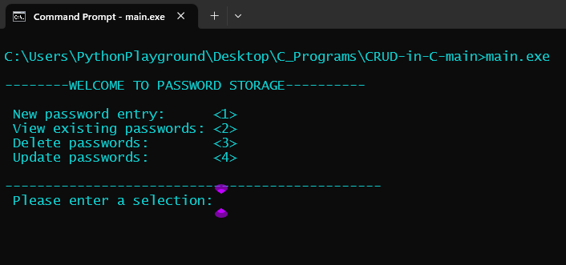
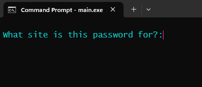
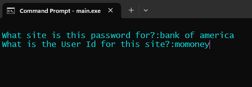
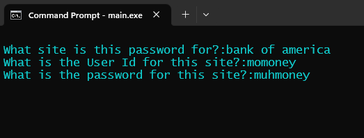
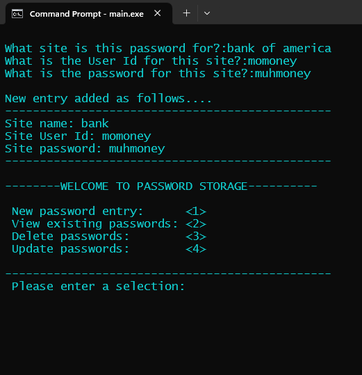
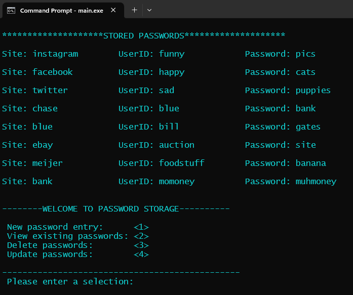
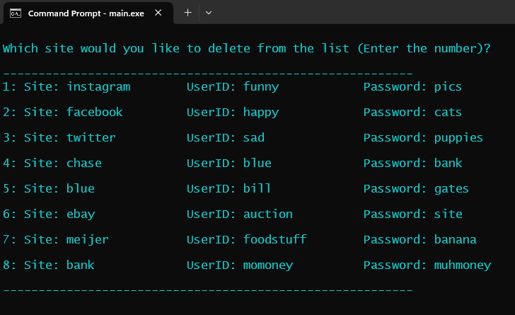

CRUD OPERATIONS IN C
--------------------

A command line program written in C that stores a users password and user id for unlimited sites.
1. Creates a password
2. Reads all stored passwords
3. Updates passwords/user id's/websites
4. Deletes passwords

Compile the C code and run in your command line. You can download the matching storage.txt file, however, if you 
don't, it will create an empty storage.txt file for you.

The application opens to a 'home page' screen with a list of options:

## NEW PASSWORD ENTRY

Option Number 1 is a new password entry:

You will be given a series of prompts asking:      
"What site is this password for?"   
"What is the User Id for this site?"   
"What is the password for this site?"   

Fill out each of the questions and hit the enter key

Once you have completed the entries, the screen will confirm your entry and show the main screen to select from.

## VIEW EXISTING PASSWORDS

Option Number 2 is to view stored passwords.

A GUI screen will appear with all sites/passwords/user id's that are currently stored.

## DELETE PASSWORDS

Option Number 3 is to delete existing passwords. 
A screen will show all passwords currently stored in the txt file, with a number next to them. Select the number of the password that you want to delete, and hit enter.

All of the code for this program is located in one .c file, with function prototypes declared in that file. You could 
create a .h file to store the prototypes in, and an additional .c file that holds all of the functions. I did not feel
that was necessary, but others may prefer to do that. 

Also, there are several system commands in this code. It was written for Windows. If you want to use it on a Linux system, 
you will need to modify the commands. 
